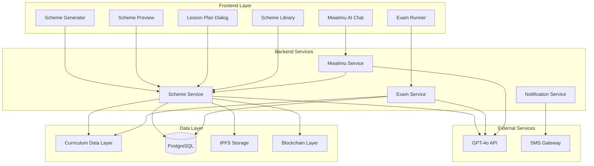

# Design Document: Schemer v2.0 Integration

## Overview

This design document outlines the integration of Schemer v2.0 (`scheme-scribe-ai` repository) into SyncSenta as a production-grade scheme-of-work generation and comprehensive assessment system. The integration transforms SyncSenta into a complete CBC curriculum delivery platform by adding:

1. **Unified CBC Curriculum Data Layer** - Complete KICD curriculum data for PP1-Grade 6
2. **Six-Step Scheme Generation Wizard** - Guided scheme creation with AI assistance  
3. **AI-Powered Content Generation** - GPT-4o integration via Rust/Axum backend
4. **Comprehensive Exam System** - Auto-generating and auto-marking assessments
5. **Scheme Library & Student Visibility** - Persistent storage with IPFS and student access
6. **Mwalimu AI Integration** - Context-aware tutoring based on current schemes
7. **Blockchain Credentials** - Verifiable teacher achievements on Polygon

The design preserves all Schemer v2.0 guardrails and data quality while seamlessly integrating with SyncSenta's existing PostgreSQL, IPFS, and blockchain infrastructure.

## Architecture

### System Components



### Integration Points

1. **Frontend Integration**: Replace `frontend/src/components/mvp/schemer-generator.tsx` with full Schemer v2.0 components
2. **Backend Integration**: Extend existing `backend/syncsenta-backend/src/services/scheme.rs` with v2.0 functionality
3. **Database Integration**: Add new tables for exams, lesson plans, and enhanced scheme storage
4. **API Integration**: Replace Supabase edge functions with Rust/Axum endpoints
5. **AI Integration**: Centralize all AI calls through SyncSenta's GPT-4o configuration

## Components and Interfaces

### Frontend Components

#### Curriculum Data Layer (`frontend/src/data/curriculum/`)

**Purpose**: Unified CBC curriculum data module providing KICD-compliant curriculum information.

**Key Types**:
```typescript
interface SchemeRow {
  week: number;
  lesson: number;
  strand: string;
  subStrand: string;
  specificLearningOutcome: string;
  keyInquiryQuestion: string;
  learningExperiences: string;
  learningResources: string;
  assessmentMethods: string;
  reflection?: string;
}

interface ExamQuestion {
  id: string;
  type: 'mcq' | 'short' | 'long';
  strand: string;
  subStrand: string;
  question: string;
  marks: number;
  // Type-specific fields
  options?: string[]; // MCQ only
  correctAnswer?: number; // MCQ only
  expectedAnswer?: string; // Short answer only
  keywords?: string[]; // Short answer only
  rubric?: MarkingRubric; // Long answer only
}

interface StrandInfo {
  name: string;
  subStrands: SubStrandInfo[];
}

interface SubStrandInfo {
  name: string;
  learningOutcomes: string[];
  termAllocation?: number; // For non-language subjects
  weeklyDistribution?: number[]; // For language subjects
}
```

**Key Functions**:
- `getSubjectsForGrade(grade: CBCGradeLevel): string[]`
- `getStrandsForSubject(grade: CBCGradeLevel, subject: string): StrandInfo[]`
- `getSubStrandsForStrand(grade: CBCGradeLevel, subject: string, strand: string): SubStrandInfo[]`
- `getTermAllocation(grade: CBCGradeLevel, subject: string, term: number): TermAllocation`
- `getWeeklyDistribution(grade: CBCGradeLevel, subject: string, term: number): WeeklyDistribution`

#### Scheme Generator (`frontend/src/components/teacher/scheme-generator.tsx`)

**Purpose**: Six-step wizard for guided scheme creation with AI assistance.

**Steps**:
1. **Grade Selection**: PP1-Grade 6 with subject filtering
2. **Subject Selection**: KICD-compliant subjects with indigenous language support
3. **Term Selection**: Terms 1-3 with academic year context
4. **Strand/Sub-strand Selection**: Curriculum-driven selection with term allocation
5. **Teacher Inputs**: KIQ, learning outcomes, experiences, resources, assessment
6. **Preview & Generation**: AI-powered scheme generation with real-time preview

**State Management**:
```typescript
interface SchemeGeneratorState {
  currentStep: number;
  grade: CBCGradeLevel;
  subject: string;
  indigenousLanguage?: string;
  term: number;
  selectedStrands: string[];
  selectedSubStrands: string[];
  teacherInputs: TeacherInputs;
  generatedScheme: SchemeRow[];
  isGenerating: boolean;
}
```

#### Scheme Preview (`frontend/src/components/teacher/scheme-preview.tsx`)

**Purpose**: Formatted table display of generated schemes with export capabilities.

**Features**:
- CBC-compliant column headers (English/Kiswahili)
- Per-row lesson plan generation
- DOCX/PDF export functionality
- Scheme saving to library
- Read-only mode for students

#### Exam Runner (`frontend/src/components/student/exam-runner.tsx`)

**Purpose**: Interactive exam delivery with auto-marking and immediate feedback.

**Features**:
- Clean, distraction-free interface
- Timer and progress tracking
- Keyboard navigation support
- Auto-save functionality
- Immediate MCQ/short answer marking
- Detailed results with improvement recommendations

#### Lesson Plan Dialog (`frontend/src/components/teacher/lesson-plan-dialog.tsx`)

**Purpose**: Per-lesson detailed planning with AI generation.

**Content Structure**:
- Lesson title and duration
- Learning objectives
- Introduction activity (5-10 min)
- Main activity (20-25 min)
- Closing activity (5-10 min)
- Assessment strategy
- Required resources

### Backend Services

#### Scheme Service (`backend/syncsenta-backend/src/services/scheme.rs`)

**Enhanced Functionality**:

```rust
pub struct SchemeService {
    db: PgPool,
    ai_client: AIClient,
    ipfs_client: IPFSClient,
    blockchain_client: BlockchainClient,
}

impl SchemeService {
    // Core generation
    pub async fn generate_scheme(&self, req: SchemeGenerationRequest) -> Result<GeneratedScheme>;
    pub async fn generate_lesson_plan(&self, scheme_row: &SchemeRow) -> Result<LessonPlan>;
    
    // Library management
    pub async fn save_scheme(&self, scheme: &GeneratedScheme) -> Result<Uuid>;
    pub async fn get_teacher_schemes(&self, teacher_id: Uuid) -> Result<Vec<SchemeMetadata>>;
    pub async fn get_scheme_by_id(&self, scheme_id: Uuid) -> Result<GeneratedScheme>;
    
    // Student access
    pub async fn get_student_schemes(&self, student_id: Uuid) -> Result<Vec<SchemeMetadata>>;
    
    // Validation and guardrails
    fn validate_scheme_structure(&self, scheme: &[SchemeRow]) -> Result<()>;
    fn sanitize_ai_content(&self, content: &str) -> String;
    fn enforce_curriculum_alignment(&self, scheme: &mut GeneratedScheme) -> Result<()>;
}
```

#### Exam Service (`backend/syncsenta-backend/src/services/exam.rs`)

**New Service for Comprehensive Assessment**:

```rust
pub struct ExamService {
    db: PgPool,
    ai_client: AIClient,
    scheme_service: Arc<SchemeService>,
}

impl ExamService {
    // Exam generation
    pub async fn generate_exam_from_scheme(&self, scheme_id: Uuid, config: ExamConfig) -> Result<GeneratedExam>;
    pub async fn generate_practice_exam(&self, weak_areas: &[WeakArea]) -> Result<GeneratedExam>;
    
    // Exam delivery
    pub async fn start_exam_session(&self, exam_id: Uuid, student_id: Uuid) -> Result<ExamSession>;
    pub async fn submit_answer(&self, session_id: Uuid, question_id: String, answer: Answer) -> Result<()>;
    pub async fn submit_exam(&self, session_id: Uuid) -> Result<ExamResults>;
    
    // Auto-marking
    pub async fn mark_mcq_question(&self, question: &MCQQuestion, answer: &MCQAnswer) -> Result<MarkResult>;
    pub async fn mark_short_answer(&self, question: &ShortAnswerQuestion, answer: &ShortAnswerAnswer) -> Result<MarkResult>;
    
    // Analytics
    pub async fn get_class_analytics(&self, class_id: Uuid, exam_id: Uuid) -> Result<ClassAnalytics>;
    pub async fn identify_weak_areas(&self, student_id: Uuid, exam_results: &ExamResults) -> Result<Vec<WeakArea>>;
    
    // Export
    pub async fn generate_printable_exam(&self, exam_id: Uuid) -> Result<PrintableExam>;
}
```

## Data Models

### Database Schema Extensions

```sql
-- Enhanced schemes table
CREATE TABLE schemes (
    id UUID PRIMARY KEY DEFAULT uuid_generate_v4(),
    teacher_id UUID NOT NULL REFERENCES users(id),
    curriculum_ref VARCHAR(255) NOT NULL,
    subject VARCHAR(100) NOT NULL,
    grade_level cbc_grade_level NOT NULL,
    term SMALLINT NOT NULL CHECK (term BETWEEN 1 AND 3),
    academic_year INT NOT NULL,
    language supported_language NOT NULL DEFAULT 'en',
    scheme_rows JSONB NOT NULL, -- Array of SchemeRow objects
    metadata JSONB, -- Additional scheme metadata
    ipfs_cid VARCHAR(255),
    blockchain_tx_hash VARCHAR(255),
    created_at TIMESTAMPTZ NOT NULL DEFAULT NOW(),
    updated_at TIMESTAMPTZ NOT NULL DEFAULT NOW(),
    
    UNIQUE(teacher_id, curriculum_ref, term, academic_year)
);

-- Lesson plans table
CREATE TABLE lesson_plans (
    id UUID PRIMARY KEY DEFAULT uuid_generate_v4(),
    scheme_id UUID NOT NULL REFERENCES schemes(id) ON DELETE CASCADE,
    week_number INT NOT NULL,
    lesson_number INT NOT NULL,
    title VARCHAR(255) NOT NULL,
    duration_minutes INT NOT NULL DEFAULT 40,
    objectives TEXT[] NOT NULL,
    introduction_activity TEXT NOT NULL,
    main_activity TEXT NOT NULL,
    closing_activity TEXT NOT NULL,
    assessment_strategy TEXT NOT NULL,
    required_resources TEXT[] NOT NULL,
    generated_at TIMESTAMPTZ NOT NULL DEFAULT NOW(),
    
    UNIQUE(scheme_id, week_number, lesson_number)
);

-- Exams table
CREATE TABLE exams (
    id UUID PRIMARY KEY DEFAULT uuid_generate_v4(),
    scheme_id UUID NOT NULL REFERENCES schemes(id),
    teacher_id UUID NOT NULL REFERENCES users(id),
    title VARCHAR(255) NOT NULL,
    description TEXT,
    questions JSONB NOT NULL, -- Array of ExamQuestion objects
    total_marks INT NOT NULL,
    time_limit_minutes INT,
    question_distribution JSONB NOT NULL, -- MCQ/Short/Long percentages
    created_at TIMESTAMPTZ NOT NULL DEFAULT NOW(),
    updated_at TIMESTAMPTZ NOT NULL DEFAULT NOW()
);

-- Exam sessions table
CREATE TABLE exam_sessions (
    id UUID PRIMARY KEY DEFAULT uuid_generate_v4(),
    exam_id UUID NOT NULL REFERENCES exams(id),
    student_id UUID NOT NULL REFERENCES users(id),
    started_at TIMESTAMPTZ NOT NULL DEFAULT NOW(),
    submitted_at TIMESTAMPTZ,
    answers JSONB NOT NULL DEFAULT '{}', -- Question ID -> Answer mapping
    auto_marked_score NUMERIC(5,2),
    manual_marked_score NUMERIC(5,2),
    total_score NUMERIC(5,2),
    time_spent_minutes INT,
    
    UNIQUE(exam_id, student_id)
);

-- Exam results table
CREATE TABLE exam_results (
    id UUID PRIMARY KEY DEFAULT uuid_generate_v4(),
    session_id UUID NOT NULL UNIQUE REFERENCES exam_sessions(id),
    strand_scores JSONB NOT NULL, -- Strand -> Score mapping
    weak_areas JSONB NOT NULL, -- Array of identified weak areas
    improvement_recommendations TEXT[],
    generated_at TIMESTAMPTZ NOT NULL DEFAULT NOW()
);

-- Scheme credentials table (blockchain integration)
CREATE TABLE scheme_credentials (
    id UUID PRIMARY KEY DEFAULT uuid_generate_v4(),
    teacher_id UUID NOT NULL REFERENCES users(id),
    credential_type VARCHAR(100) NOT NULL, -- 'first_scheme', 'complete_term_coverage'
    scheme_ids UUID[] NOT NULL,
    blockchain_tx_hash VARCHAR(255) NOT NULL,
    ipfs_metadata_cid VARCHAR(255),
    issued_at TIMESTAMPTZ NOT NULL DEFAULT NOW()
);
```

### API Endpoints

#### Scheme Management
- `POST /api/v1/schemes/generate` - Generate new scheme
- `GET /api/v1/schemes/teacher/{teacher_id}` - Get teacher's schemes
- `GET /api/v1/schemes/student/{student_id}` - Get student's visible schemes
- `POST /api/v1/schemes/{scheme_id}/save` - Save scheme to library
- `PUT /api/v1/schemes/{scheme_id}` - Update existing scheme
- `DELETE /api/v1/schemes/{scheme_id}` - Delete scheme

#### Lesson Plans
- `POST /api/v1/lesson-plans/generate` - Generate lesson plan for scheme row
- `GET /api/v1/lesson-plans/scheme/{scheme_id}` - Get all lesson plans for scheme
- `GET /api/v1/lesson-plans/{plan_id}` - Get specific lesson plan

#### Exam Management
- `POST /api/v1/exams/generate` - Generate exam from scheme
- `GET /api/v1/exams/teacher/{teacher_id}` - Get teacher's exams
- `POST /api/v1/exams/{exam_id}/start` - Start exam session
- `POST /api/v1/exams/sessions/{session_id}/answer` - Submit answer
- `POST /api/v1/exams/sessions/{session_id}/submit` - Submit complete exam
- `GET /api/v1/exams/results/{session_id}` - Get exam results
- `GET /api/v1/exams/{exam_id}/analytics` - Get class analytics

#### Export Services
- `POST /api/v1/export/scheme/{scheme_id}/docx` - Export scheme as DOCX
- `POST /api/v1/export/lesson-plan/{plan_id}/docx` - Export lesson plan as DOCX
- `POST /api/v1/export/exam/{exam_id}/pdf` - Export printable exam as PDF

## Correctness Properties

*A property is a characteristic or behavior that should hold true across all valid executions of a system-essentially, a formal statement about what the system should do. Properties serve as the bridge between human-readable specifications and machine-verifiable correctness guarantees.*

### Property 1: Curriculum Data Completeness
*For any* valid grade-subject combination, the Curriculum Data Layer SHALL return at least one strand with at least one sub-strand.
**Validates: Requirements 1.9**

### Property 2: Curriculum Data Lookup Consistency  
*For any* valid grade-subject pair, the returned strands SHALL be non-empty and match the expected KICD structure.
**Validates: Requirements 1.3**

### Property 3: Hierarchical Data Integrity
*For any* valid grade-subject-strand combination, the returned sub-strands SHALL be appropriate for that strand.
**Validates: Requirements 1.4**

### Property 4: Term Allocation Completeness
*For any* non-language subject and valid grade-term combination, the term allocation SHALL be complete and non-overlapping.
**Validates: Requirements 1.5**

### Property 5: Weekly Distribution Coverage
*For any* language subject and valid grade-term combination, the weekly distribution SHALL cover all weeks with appropriate content.
**Validates: Requirements 1.6**

### Property 6: Error Handling Graceful Degradation
*For any* invalid grade-subject-strand combination, the system SHALL return an empty array and log a warning without throwing exceptions.
**Validates: Requirements 1.8**

### Property 7: UI State Consistency
*For any* grade selection, only valid subjects for that grade SHALL be shown in the subject selection step.
**Validates: Requirements 2.2**

### Property 8: Conditional UI Rendering
*For any* language subject selection, weekly distribution controls SHALL be shown; for non-language subjects, term allocation controls SHALL be shown.
**Validates: Requirements 2.3, 2.4**

### Property 9: Navigation Data Persistence
*For any* navigation pattern and data input in the wizard, data SHALL be preserved when navigating backward.
**Validates: Requirements 2.8**

### Property 10: Form Validation Enforcement
*For any* wizard step with missing required fields, validation SHALL prevent progression to the next step.
**Validates: Requirements 2.9**

### Property 11: Complete Scheme Generation
*For any* valid teacher inputs, the Scheme Service SHALL generate a complete scheme with all required fields populated.
**Validates: Requirements 3.1**

### Property 12: Subject-Based Generation Mode
*For any* language subject, weekly mode SHALL be used; for non-language subjects, term mode SHALL be used.
**Validates: Requirements 3.2**

### Property 13: Week Numbering Invariant
*For any* generated scheme, week numbers SHALL be sequential starting from 1 with no gaps or duplicates.
**Validates: Requirements 3.3, 4.2**

### Property 14: Lesson Numbering Invariant
*For any* generated scheme, lesson numbers within each week SHALL be sequential starting from 1.
**Validates: Requirements 3.4, 4.3**

### Property 15: Content Sanitization
*For any* AI-generated field, the content SHALL contain only printable characters and be under 1000 characters.
**Validates: Requirements 3.5, 4.5**

### Property 16: JSON Recovery Attempt
*For any* malformed JSON response from AI, recovery SHALL be attempted before returning an error.
**Validates: Requirements 3.6**

### Property 17: Scheme Coverage Completeness
*For any* term configuration, the returned SchemeRow array SHALL cover all required weeks and lessons.
**Validates: Requirements 3.9**

### Property 18: Required Field Validation
*For any* generated SchemeRow, all required fields (strand, subStrand, specificLearningOutcome, keyInquiryQuestion, learningExperiences, learningResources, assessmentMethods) SHALL be non-empty.
**Validates: Requirements 4.1**

### Property 19: Validation Error Recovery
*For any* invalid SchemeRow field, a KICD-compliant placeholder SHALL be generated rather than returning an error.
**Validates: Requirements 4.4**

### Property 20: Curriculum Alignment Preservation
*For any* teacher selection and generated SchemeRow, the strand and subStrand SHALL match the teacher's curriculum selection.
**Validates: Requirements 4.6**

### Property 21: SchemeRow Serialization Round-trip
*For any* valid SchemeRow array, JSON serialization and deserialization SHALL produce an array equal to the original.
**Validates: Requirements 4.7**

### Property 22: Comprehensive Exam Generation
*For any* saved scheme, the generated exam SHALL contain MCQ, short answer, and long answer questions distributed across all strands and sub-strands.
**Validates: Requirements 12.1**

### Property 23: Exam Distribution Constraints
*For any* exam configuration, question distribution SHALL fall within specified ranges (MCQ 40-60%, short answer 20-30%, long answer 10-20%) and total marks SHALL be 50-100.
**Validates: Requirements 12.2**

### Property 24: MCQ Structure Validation
*For any* generated MCQ question, there SHALL be exactly 4 options with one correct answer and a stored correct answer index.
**Validates: Requirements 12.3**

### Property 25: Short Answer Auto-marking Support
*For any* generated short answer question, expected answers and keyword lists SHALL be provided for auto-marking.
**Validates: Requirements 12.4**

### Property 26: Long Answer Rubric Provision
*For any* generated long answer question, detailed marking rubrics with point allocation criteria SHALL be provided.
**Validates: Requirements 12.5**

### Property 27: Exam Results Completeness
*For any* exam submission, results SHALL include total score, strand-wise performance, weak areas identification, and personalized improvement recommendations.
**Validates: Requirements 12.8**

### Property 28: Exam Storage Completeness
*For any* completed exam, all required fields (timestamp, student ID, teacher ID, scheme reference, question-by-question breakdown) SHALL be stored in the database.
**Validates: Requirements 12.9**

### Property 29: Retake Question Shuffling
*For any* retaken exam, question shuffling SHALL occur and weak area practice SHALL be available.
**Validates: Requirements 12.10**

### Property 30: Printable Exam Completeness
*For any* exam, the generated PDF SHALL contain the exam paper, answer sheet, and marking guide.
**Validates: Requirements 12.11**

### Property 31: Class Analytics Completeness
*For any* set of exam results, analytics SHALL include average scores, question difficulty analysis, and curriculum coverage gaps.
**Validates: Requirements 12.12**

### Property 32: Request Validation Enforcement
*For any* invalid request to backend services, an HTTP 422 response with descriptive error SHALL be returned.
**Validates: Requirements 13.3**

### Property 33: Data Validation Before Persistence
*For any* invalid data, rejection with descriptive error SHALL occur before database persistence.
**Validates: Requirements 13.4**

### Property 34: Data Object Serialization Round-trip
*For any* valid data object, JSON serialization and deserialization SHALL preserve all fields and types without loss or coercion.
**Validates: Requirements 13.5**

## Error Handling

### AI Generation Failures
- **Malformed JSON**: Attempt structured recovery using fallback parser
- **Timeout**: Return partial results with continuation token
- **Rate Limiting**: Implement exponential backoff with user notification
- **Content Policy Violations**: Sanitize and regenerate problematic sections

### Database Failures
- **Connection Loss**: Implement connection pooling with automatic retry
- **Constraint Violations**: Return descriptive validation errors
- **Transaction Failures**: Rollback with detailed error logging

### IPFS Storage Failures
- **Upload Failures**: Continue operation without IPFS CID, retry in background
- **Retrieval Failures**: Fall back to database storage with warning notification

### Blockchain Integration Failures
- **Network Issues**: Queue credential issuance for later retry
- **Gas Estimation Failures**: Use fallback gas limits with monitoring
- **Transaction Failures**: Log for manual intervention, don't block user workflow

## Testing Strategy

### Dual Testing Approach

**Unit Tests**: Focus on specific examples, edge cases, and error conditions
- Form validation with various invalid inputs
- AI response parsing with malformed JSON
- Database constraint violations
- IPFS upload failures
- Blockchain transaction errors

**Property Tests**: Verify universal properties across all inputs (minimum 100 iterations per test)
- Curriculum data completeness and consistency
- Scheme generation structural invariants
- Exam generation distribution constraints
- Serialization round-trip properties
- Validation enforcement across all endpoints

### Property Test Configuration

Each property test references its design document property with the tag format:
**Feature: schemer-integration, Property {number}: {property_text}**

Examples:
- **Feature: schemer-integration, Property 1: For any valid grade-subject combination, the Curriculum Data Layer SHALL return at least one strand with at least one sub-strand**
- **Feature: schemer-integration, Property 13: For any generated scheme, week numbers SHALL be sequential starting from 1 with no gaps or duplicates**

### Testing Libraries
- **Backend**: `proptest` for Rust property-based testing
- **Frontend**: `fast-check` for TypeScript property-based testing
- **Integration**: `playwright` for end-to-end testing
- **Database**: `sqlx` compile-time query validation

### Test Data Generation
- **Curriculum Data**: Generate valid grade-subject-strand combinations from KICD data
- **Scheme Content**: Generate realistic teacher inputs and AI responses
- **Exam Questions**: Generate various question types with proper structure
- **User Interactions**: Generate realistic user workflows through the wizard

The testing strategy ensures comprehensive coverage while maintaining fast feedback loops for developers and reliable validation of the complex curriculum and assessment logic.